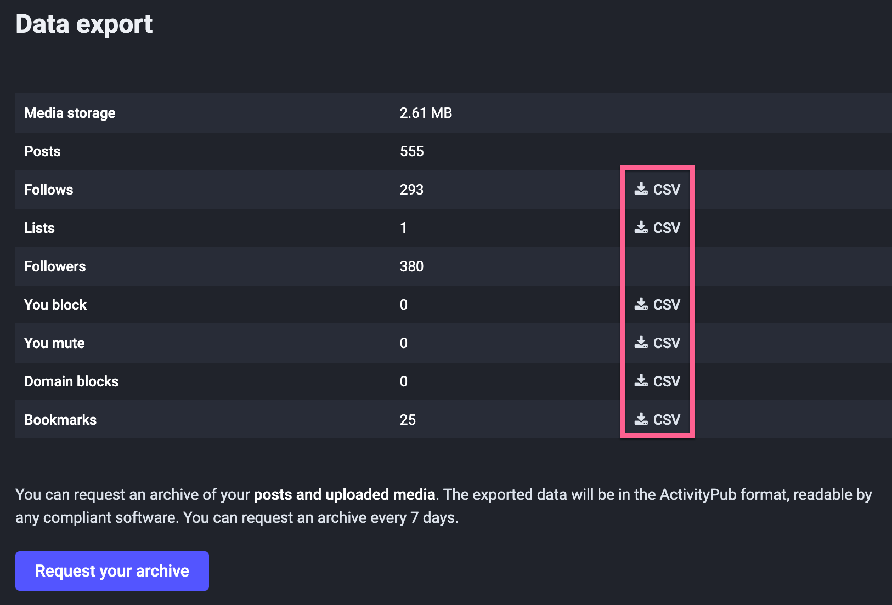
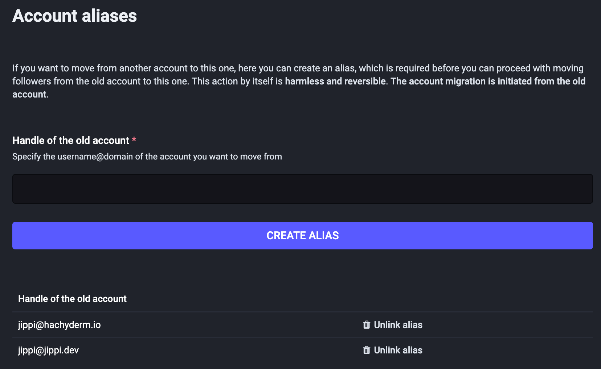
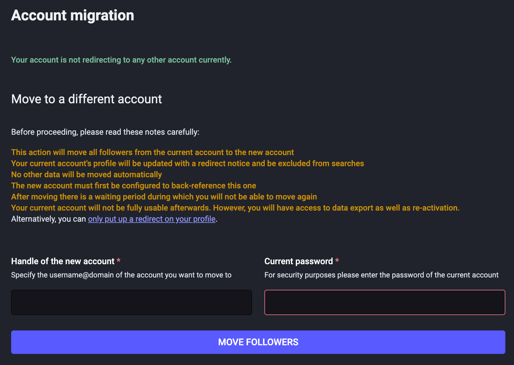
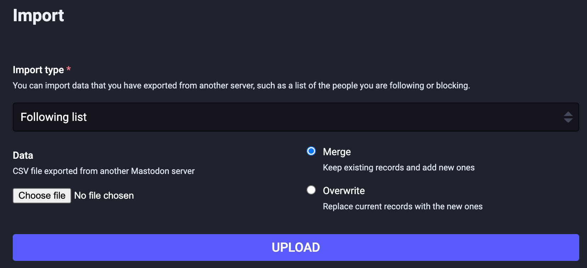

# Move to another Mastodon server

!!! warning "Important information about what data that can be moved between serves"

    You will *not* lose your followers; the Mastodon network will make sure to migrate them to the **new** server transparently and forward any messages sent to your **old** account to the **new** one. People with `private` accounts will need to accept your follow request again.

    Posts you made on the **old** server can't be moved to the **new** server; the posts will remain on the **old** server until you delete that account (optional).

    *Almost* all other data can be moved manually, and is covered within this guide.

This guide will help you move your account to another server.

You can check out the [official documentation on moving accounts between servers](https://docs.joinmastodon.org/user/moving/){target="_blank"} if this guide isn't clear.

## 1. Guide configuration

To make the guide as easy as possible, please provide which server you are moving **from** and **to** below.

Filling out the two fields below will make all links in this guide automatically point to your correct servers and the pages you need to access. It's, of course, entirely optional if you prefer not to fill it out.

!!! tip "You can write either the `server domain name` (ex. `mastodon.social`) or any link from the server (ex. `https://mastodon.social/profile`)."

1. I'm **leaving** my **old** server at: <input id="from-server" placeholder="Write or paste your old server domain/link" class="server-selector" />
1. and **joining** my **new** server at: <input id="to-server" placeholder="Write or paste your new server domain/link" class="server-selector" />

*If a field has a red border, it's empty or not configured correctly_.*

## 2. Export your data

!!! info "These steps all take place on the **old** server (ex. )"

    In this step, we export your data from the **old** server, so we can import it later on the **new** server.

    If you don't care about your old data - or don't have any - feel free to skip this step fully or partially.

!!! warning "Do not use `Request your archive` for migrating data; you can *not* import that file on the new server. It's great for regular backups though"

<figure markdown>
{align="right" width="50%" loading=lazy}
<figcaption>The export data page looks like this.</figcaption>
</figure>

On the **old** server, navigate to the <a identity="old" path="/settings/export" href="#">`Preferences -> Import and Export`</a> page in the left menu.

In the table, click on the `⬇️ CSV` link for each kind of data you want to migrate to the new server.

* <a identity="old" target="_blank" path="/settings/exports/follows.csv">⬇️ Click to download your `follows list`</a>
* <a identity="old" target="_blank" path="/settings/exports/blocks.csv">⬇️ Click to download your `block list`</a>
* <a identity="old" target="_blank" path="/settings/exports/mutes.csv">⬇️ Click to download your `mute list`</a>
* <a identity="old" target="_blank" path="settings/exports/domain_blocks.csv">⬇️ Click to download your `domain blocks`</a>
* <a identity="old" target="_blank" path="/settings/exports/bookmarks.csv">⬇️ Click to download your `bookmarks`</a>

Note that the following can't be imported:

* `Lists`
* `Followers` - they are automatically handled later in the guide.

!!! success "Done!"

    Now that we have a backup of your **old** data, we can import it on the new server later in this guide.

    In the next step, we will prepare your **new** account for the server migration.

## 3. Setting up your new account

!!! info "These steps all take place on the **new** server (ex. )"

    This step configures your **new** account to accept the account migration from the **old** server as well as copying your profile information.

<figure markdown>
{align="right" width="50%" loading=lazy}
<figcaption>Use your full username from the old server.  (ex. .)</figcaption>
</figure>

1. If you haven't already, <a identity="new" target="_blank" path="/auth/sign_up">create an account on the **new** server.</a>
1. Create an account alias on **new** server.
    1. <a identity="new" target="_blank" path="/settings/aliases">`Preferences -> Profile -> (scroll to the bottom) "Moving from a different account"`</a>
     
    You need to add the *full* username from your **old** server
     
    ex. .
1. Your new account on the **new** server is probably a bit empty. No `bio`, `profile picture` and so on. This is an excellent time to copy this over from your **old** account.
    1. <a identity="old" target="_blank" path="/settings/profile">Open your **old** account (`Preferences -> Profile`)</a>
    1. <a identity="new" target="_blank" path="/settings/profile">Open your **new** account (`Preferences -> Profile`)</a>
    1. Start copying fields one by one and tweak as necessary.

!!! success "Done!"

    Your **new** account is now configured to accept the migration request from your **old** server and your profile looks amazing with a picture, bio and so forth, just like your old account.

    In the next step, we will start the account migration process.

## 4. Migrate to the new server

!!! info "These steps all take place on the **old** server (ex. )"

    This still will move all your followers to the new server. The change is transparent to your followers, and neither they nor you need to take any additional manual steps beyond what's covered in this guide.

!!! warning "Please read the warning text on the *migration page* to make sure you are okay with the consequences."

<figure markdown>
{align=right width=50% loading=lazy}
<figcaption>The <code>Account Migration</code> page has important warning that you should read carefully.</figcaption>
</figure>

1. Navigate to <a identity="old" target="_blank" path="/settings/migration">`Preferences -> Profile -> (scroll to the bottom) "Move to a different account"`</a>
     
    1. For the `Handle of the new account` field, enter your username on the **new** server (ex. ))
    1. For the `Password` field, enter the password you use on the **old** server (ex. )
    1. Click `Move followers`

!!! success "Done!"

    The Mastodon network will move your followers from the **old** server to the **new** one.

    Depending on server capacity, this can take anywhere from a minute to an hour.

    We can let the migration run in the background, continue to the next step, and import your old data into the new server.

## 5. Import your data

!!! info "These steps all take place on the **new** server (ex. )"

<figure markdown>
{align=right width=50% loading=lazy}
<figcaption>The import page should look like this.</figcaption>
</figure>

1. Navigate to <a identity="new" target="_blank" path="/settings/import">`Preferences -> Import and export -> Import`</a>
1. For *each* option in the `Import type` dropdown, do the following
    1. Select the `Import type` you wish to import.
         
        I would recommend taking them in the order they appear in the dropdown
    1. Select the file you exported corresponding to the `Import type` you selected by clicking the file input (`Choose file`)
        1. `Following list` file is called something like `follows.csv` in your Downloads folder
        1. `Blocking list` file is called something like `blocks.csv` in your Downloads folder
        1. `Muting list` file is called something like `mutes.csv` in your Downloads folder
        1. `Domain blocking list` file is called something like `domain_blocks.csv` in your Downloads folder
        1. `Bookmarks` file is called something like `bookmarks.csv` in your Downloads folder
    1. Make sure to select `Merge` and **not** `Overwrite`
    1. Click `Upload`

!!! success "Done!"

    All your data has now been imported to the new server, and things should really start to look and feel like home again.

    In the next, and final, step, we'll set up your profile information on the new server.

## 6. Wrapping up

Now that you are all set up on your new server, check out these guides

* [Getting started on Mastodon](getting-started-on-mastodon.md)
* [Tips and Tricks](tips.md)
* [Twitter and Mastodon](twitter-and-mastodon.md)
